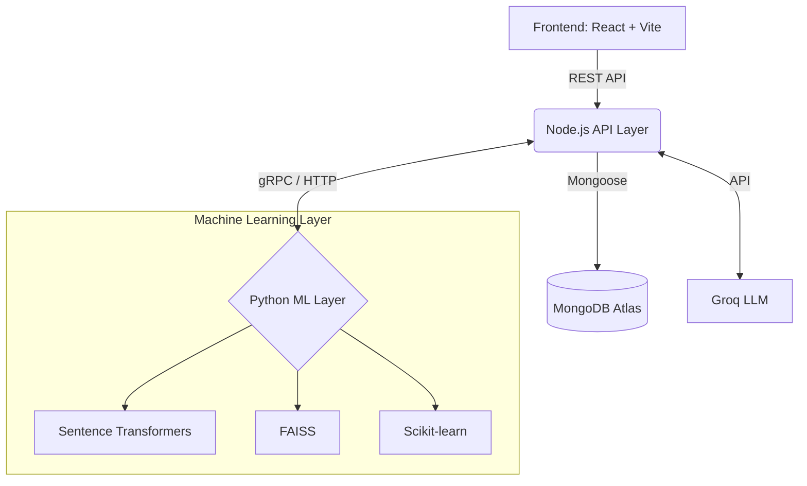

# 1. Hero Section
<h1 align="center">ResumeIQ</h1>

<p align="center">
  <b>AI-Powered Hiring Intelligence Platform for Ethical, Explainable, and Data-Driven Recruitment.</b>
</p>

<p align="center">
  
  
  
  
  
  
  
  
</p>

---

## 📖 2. Overview

**The Problem:** Traditional hiring relies heavily on keyword matching and subjective evaluations. Recruiters spend countless hours manually screening resumes, often missing out on highly qualified candidates due to unconscious biases or rigid keyword filters.

**The Solution:** **ResumeIQ** combines ATS screening, semantic matching, fairness-aware evaluation, dynamic AI interviews, and recruiter intelligence dashboards into a single, cohesive platform. It ensures candidates are evaluated on their true skills while giving recruiters an intelligent toolkit to make faster, fairer, and more explainable hiring decisions.

---

## ✨ 3. Core Features

### 👨‍💻 Candidate Side
*   **🏢 LinkedIn-style Jobs Board:** Discover and apply for open positions in a familiar, intuitive interface.
*   **📄 Resume Upload & ATS Screening:** Seamless document parsing and initial screening.
*   **⚖️ Bias-Aware Evaluation:** Redacts identity markers to ensure a fair initial review.
*   **🧠 Semantic Resume Matching:** Goes beyond keywords to understand the actual context and depth of skills.
*   **📉 Skill Gap Analysis:** Provides actionable insights to candidates on what they lack for a specific role.
*   **🤖 Dynamic AI Interview Generation:** Custom, adaptive interviews based on the candidate's resume and job description.
*   **💻 Mandatory Technical Assessments:** Ensures baseline technical competency.

### 👩‍💼 Recruiter Side
*   **🎛️ AI Recruiter Dashboard:** A centralized hub for managing the entire hiring pipeline.
*   **⚖️ Candidate Comparison Engine:** Side-by-side, data-driven comparison of top applicants.
*   **🗄️ Candidate Audit Drawer:** Deep dive into a specific candidate's evaluation, scores, and interview responses.
*   **📊 Recruiter Intelligence Analytics:** High-level metrics on job performance and pipeline health.
*   **📝 Dynamic Role Creation:** Easily generate and configure new job openings with AI assistance.
*   **👥 Candidate & Role Management:** Streamlined tracking of applicants across different stages.

---

## 🏗️ 4. Architecture

ResumeIQ leverages a modern, distributed architecture for scalability and performance.

*   **Frontend:** React + Vite
*   **Backend API Layer:** Node.js
*   **ML Layer:** Python
*   **Database:** MongoDB Atlas

**Key AI Technologies:**
*   **Sentence Transformers:** For generating rich embeddings of resumes and job descriptions.
*   **FAISS:** Facebook AI Similarity Search for blazingly fast semantic matching.
*   **Groq LLM:** Powering dynamic AI interviews and natural language insights.
*   **Scikit-learn:** For predictive modeling and traditional ML tasks.



---

## 🔄 5. End-to-End Workflow

1.  **Recruiter creates role:** HR defines the job requirements and publishes the opening.
2.  **JD intelligence extracts skills:** The AI automatically extracts core competencies and requirements from the Job Description.
3.  **Candidate uploads resume:** Applicant applies via the Jobs Board.
4.  **ATS + Semantic scoring:** Resumes are parsed, and semantic matching computes a relevance score.
5.  **Skill gap analysis:** The system identifies missing skills for both the recruiter's and candidate's view.
6.  **AI interview generation:** A tailored interview is dynamically generated based on the candidate's profile and the role's needs.
7.  **Interview evaluation:** The candidate completes the assessment, and AI grades the responses.
8.  **Recruiter analytics and comparison:** HR reviews the top candidates through the comparison engine and makes data-backed decisions.

---

## 🛠️ 6. Tech Stack

| Domain | Technologies |
| :--- | :--- |
| **Frontend** | React 19, Vite, Vanilla CSS, React Router |
| **Backend** | Node.js, Express.js |
| **Database** | MongoDB Atlas, Mongoose |
| **Machine Learning** | Python, Scikit-learn, Pandas, FAISS, Sentence Transformers |
| **LLM Integrations** | Groq API (LLaMA 3) |
| **Parsing & Others**| PDF-parse |

---

## 📸 7. Screenshots Section

### Candidate Portal


### Recruiter Portal


*(Replace markdown image placeholders with actual screenshots in the `/assets` folder)*

---

## 💻 8. Installation Guide

### Prerequisites
- Node.js (v18+)
- Python (v3.9+)
- MongoDB Atlas Account
- Groq API Key

### Backend Setup
```bash
cd backend
npm install
```
Create a `.env` file in the `backend` directory:
```env
PORT=5000
MONGODB_URI=your_mongodb_connection_string
GROQ_API_KEY=your_groq_api_key
```
*(Optional) Install Python ML dependencies if running local ML services:*
```bash
pip install pandas scikit-learn sentence-transformers faiss-cpu
```
Start the backend server:
```bash
npm run dev
```

### Frontend Setup
```bash
cd frontend
npm install
```
Start the development server:
```bash
npm run dev
```

---

## 📁 9. Project Structure

```text
ResumeIQ/
├── backend/
│   ├── config/
│   ├── controllers/
│   ├── middlewares/
│   ├── ml/
│   ├── models/
│   ├── routes/
│   ├── services/
│   ├── utils/
│   └── server.js
├── frontend/
│   ├── public/
│   ├── src/
│   │   ├── assets/
│   │   ├── components/
│   │   ├── pages/
│   │   ├── App.jsx
│   │   ├── index.css
│   │   └── main.jsx
│   ├── index.html
│   └── vite.config.js
└── README.md
```

---

## 🚀 10. Future Enhancements

*   📧 **Email notifications:** Automated updates for candidates regarding their application status.
*   🎥 **Video interviews:** AI-proctored asynchronous video assessments.
*   💡 **Resume recommendations:** Actionable feedback for candidates to improve their CVs.
*   🤖 **AI hiring copilot:** A conversational assistant for recruiters to query applicant data naturally.
*   📈 **Advanced analytics:** Predictive modeling for candidate success and retention.

---

## 🤝 11. Contributors

*   **Shreya Gupta** - *Creator & Lead Developer* - [GitHub](https://github.com/shreya-osr5513)

---
<p align="center">Made with ❤️ for fairer hiring.</p>
