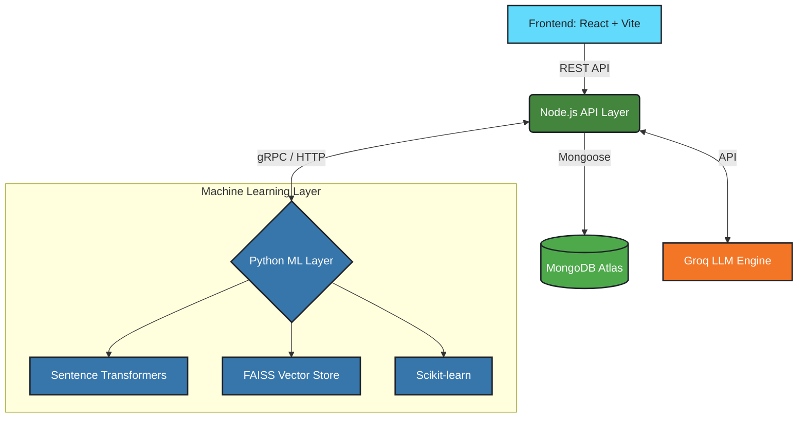

<div align="center">

  <h1>ResumeIQ</h1>
  
  <p>
    <b>AI-Powered Hiring Intelligence Platform for Ethical, Explainable, and Data-Driven Recruitment.</b>
  </p>

  <p>
    
    
    
    
    
    
    
  </p>
</div>

<br />

> **The Problem:** Traditional hiring relies heavily on keyword matching and subjective evaluations. Recruiters spend countless hours manually screening resumes, often missing out on highly qualified candidates due to unconscious biases or rigid keyword filters.
> 
> **The Solution:** **ResumeIQ** combines ATS screening, semantic matching, fairness-aware evaluation, dynamic AI interviews, and recruiter intelligence dashboards into a single, cohesive platform. It ensures candidates are evaluated on their true skills while giving recruiters an intelligent toolkit to make faster, fairer, and more explainable hiring decisions.

<br />

## 🏆 Key Achievements

*   **⚡ Sub-second Matching:** Employs FAISS and Sentence Transformers to compute semantic similarities between resumes and job descriptions in milliseconds.
*   **🛡️ Bias Elimination:** Incorporates a Bias-Aware Evaluation module that actively redacts PII and minimizes unconscious bias in the initial screening phase.
*   **🤖 Dynamic Assessment:** Uses Groq's high-speed inference to generate hyper-personalized interview questions on the fly, tailoring difficulty and topics to the candidate's exact resume and the job description.

<br />

## ✨ Feature Showcase

| Module | Feature | Description | For Who? |
| :--- | :--- | :--- | :---: |
| **Portal** | 🏢 **Jobs Board** | Discover and apply for open positions in an intuitive interface. | 👨‍💻 Candidate |
| **Parsing** | 📄 **Resume ATS** | Seamless document parsing (PDFs) and initial skill extraction. | 👨‍💻 Candidate |
| **Intelligence** | 🧠 **Semantic Matching** | Goes beyond keywords to understand the context/depth of skills. | 👩‍💼 Recruiter |
| **Ethics** | ⚖️ **Bias-Aware Screen** | Redacts identity markers to ensure a fair initial review. | 👩‍💼 Recruiter |
| **Analytics** | 📉 **Skill Gap Analysis** | Actionable insights for candidates on lacking skills for a role. | Both |
| **Evaluation** | 🤖 **AI Interviews** | Custom, adaptive interviews generated by Groq LLM. | Both |
| **Management** | 🎛️ **HR Dashboard** | Centralized hub for tracking applicants, roles, and metrics. | 👩‍💼 Recruiter |
| **Decision** | ⚖️ **Comparison Engine**| Side-by-side, data-driven comparison of top applicants. | 👩‍💼 Recruiter |

<br />

## 🏗️ System Architecture

ResumeIQ leverages a modern, distributed architecture for scalability and performance. The frontend interacts with a Node.js API, which delegates ML-heavy tasks to a dedicated Python layer and interfaces with external LLM providers.



<br />

## 🔄 End-to-End Workflow

1.  **Role Creation:** HR defines the job requirements and publishes the opening.
2.  **JD Intelligence:** AI automatically extracts core competencies from the Job Description.
3.  **Application:** Applicant applies via the Jobs Board and uploads their resume.
4.  **Semantic Scoring:** Resumes are parsed; FAISS computes a semantic relevance score.
5.  **Gap Analysis:** The system identifies missing skills for both the recruiter's and candidate's view.
6.  **AI Interview:** A tailored interview is dynamically generated based on the candidate's profile.
7.  **Evaluation:** The candidate completes the assessment, and AI grades the responses.
8.  **Hiring Decision:** HR reviews top candidates via the comparison engine to make data-backed choices.

<br />

## 🛠️ Tech Stack

<details>
<summary>Click to expand technologies</summary>

<br />

*   **Frontend:** React 19, Vite, Vanilla CSS, React Router
*   **Backend:** Node.js, Express.js
*   **Database:** MongoDB Atlas, Mongoose
*   **Machine Learning:** Python, Scikit-learn, Pandas, FAISS, Sentence Transformers
*   **LLM Integrations:** Groq API (LLaMA 3)
*   **Parsing & Utilities:** PDF-parse
</details>

<br />

## 📸 Screenshots

*(Replace placeholders with actual images in the `/assets` folder)*

<div align="center">
  
  
</div>
<div align="center">
  
  
</div>

<br />

## 💻 Installation Guide

### Prerequisites
*   Node.js (v18+)
*   Python (v3.9+)
*   MongoDB Atlas Account
*   Groq API Key

### Backend Setup
```bash
cd backend
npm install
```
Create a `.env` file in the `backend` directory:
```env
PORT=5000
MONGODB_URI=your_mongodb_connection_string
GROQ_API_KEY=your_groq_api_key
```
Install Python ML dependencies:
```bash
pip install pandas scikit-learn sentence-transformers faiss-cpu
```
Start the backend server:
```bash
npm run dev
```

### Frontend Setup
```bash
cd frontend
npm install
```
Start the development server:
```bash
npm run dev
```

<br />

## 📁 Project Structure

```text
ResumeIQ/
├── backend/            # Node.js API, ML layer, controllers, services
│   ├── ml/             # Python ML scripts & models
│   ├── routes/         # Express routes
│   └── server.js       # Entry point
├── frontend/           # React + Vite application
│   ├── src/
│   │   ├── components/ # Reusable UI components
│   │   └── pages/      # View pages (HRDashboard, CandidatePortal, etc.)
│   └── vite.config.js
└── README.md
```

<br />

## 🚀 Future Enhancements

*   📧 **Email Notifications:** Automated status updates for candidates.
*   🎥 **Video Interviews:** AI-proctored asynchronous video assessments.
*   💡 **Resume Recommendations:** Actionable CV feedback for applicants.
*   🤖 **AI Hiring Copilot:** Conversational assistant for recruiters.
*   📈 **Predictive Analytics:** Modeling for candidate success and retention.

<br />

## 🤝 Contributors

*   **Shreya Gupta** - *Creator & Lead Developer* - [GitHub](https://github.com/shreya-osr5513)

---
<p align="center">Made with ❤️ for fairer hiring.</p>
